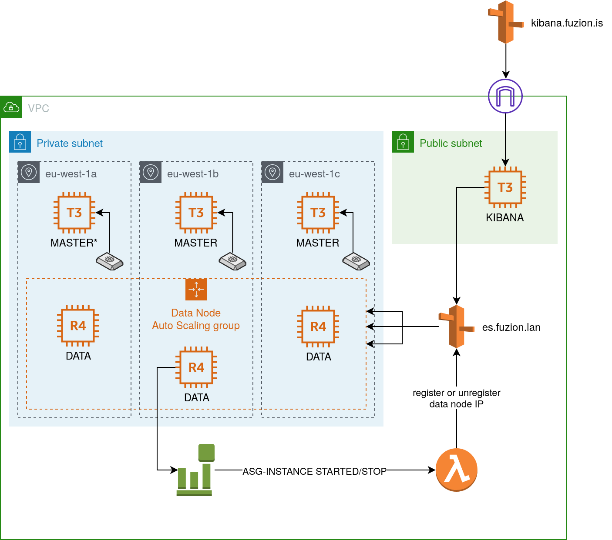

# Elasticsearch Cluster HA

This infrastructure deploy a fully horizontal scaling elasticsearch cluster self manage on AWS Cloud.
The original service provide by AWS are not really flexible and lack of update.
It can also be expensive as we saw it as one of the top expense of aws average customer billing. 

## Schema



## Deployment instruction

1. Get you a nice AWS account with a user that have cloudformation and s3 permission
2. Get a role dedicated to cloudformation service with admin permission ( or narrow to the need of stacks: EC2, IAM, LAMBDA, R53, EVENT BRIDGE )
3. Configure an environment target in `environments/mytarget.mvars`
4. Build packer opening terminal in packer `env profile=fuzion-testing-cloudformation subnet_id=subnet-0100d50d248aff53e make build`

## Configuration

| Key                    | Type                                   | Description |
|------------------------|----------------------------------------|-------------|
| accountId              | String                                 |             |
| roleName               | String                                 |             |
| vpcId                  | AWS::EC2::VPC::Id                      |             |
| publicSubnets          | List<AWS::EC2::Subnet::Id>             |             |
| privateSubnets         | List<AWS::EC2::Subnet::Id>             |             |
| availabilityZones      | List<AWS::EC2::AvailabilityZone::Name> |             |
| elasticAmiId           | AWS::EC2::Image::Id                    |             |
| keyPair                | AWS::EC2::KeyPair::KeyName             |             |
| bastionSecurityGroupId | AWS::EC2::SecurityGroup::Id            |             |
| dataInstanceType       | String                                 |             |
| clusterName            | String                                 |             |
| privateDomain          | String                                 |             |
| privateHostedZoneId    | AWS::Route53::HostedZone::Id           |             |
| baseDomain             | String                                 |             |
| enableMasterHa         | Boolean                                |             |
| enableKibana           | Boolean                                |             |
| snapshotS3BucketName   | String                                 |             |

## Source

- Resilience in small clusters: 
  https://www.elastic.co/guide/en/elasticsearch/reference/current/high-availability-cluster-small-clusters.html
- Node:
  https://www.elastic.co/guide/en/elasticsearch/reference/current/modules-node.html

## Snapshot index

https://www.elastic.co/guide/en/elasticsearch/reference/current/snapshot-restore.html#snapshot-workflow

## GOALS

1. Improve the security with the elasticsearch data nodes.
- Use a dedicated subnets
- Use traefik as proxy gateway to secure Kibana
- Implement different auth provider like oAuth to use central identity service with our cluster 

```
Considering integrate oAuth2 proxy on Traefik to use SSO on Kibana
https://github.com/oauth2-proxy/oauth2-proxy/issues/46
```

2. Scaling DATA nodes

We already have an ASG for Data nodes using SPOT instances, but there are no rules to scale out instances.

3. Monitoring

Integration of monitoring metrics of nodes

- Prometheus
- AWS Cloudwatch dashboard
- Alarm when cluster is not green anymore
